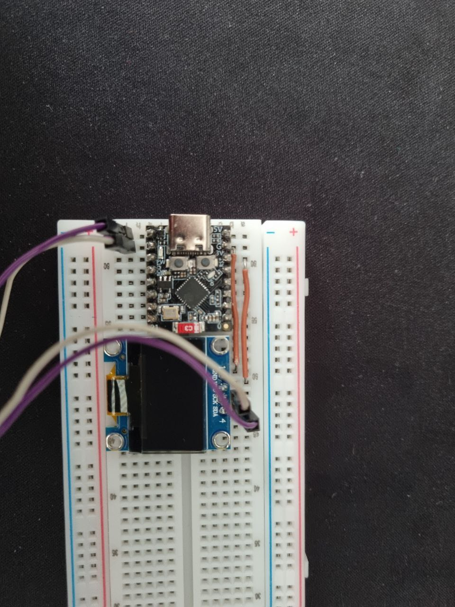

# ESP32 SSD1306 OLED Debug Display


A lightweight OLED debug console for embedded systems using an **ESP32-C3** and an **SSD1306 128×64 OLED display**.

This project demonstrates how a small OLED screen can be used as a **printf-style debugging monitor** for embedded firmware, while also integrating **LVGL** for simple graphics rendering.
The thought is to give the means to debug/show functionality in real time with an ESP32C3.

The repository includes a **custom SSD1306 driver written using ESP-IDF I²C API**, along with a display abstraction layer that exposes `display_printf()` which imitates classic printf.

---

# Features

- Custom **SSD1306 driver** using the ESP-IDF I²C master API  
- Framebuffer-based rendering  
- Integration with **LVGL graphics library**  
- Lightweight **OLED debug console API**  
- Simple `display_printf()` function for embedded status output  
- Example rendering (checkerboard test pattern)  
- Minimal hardware setup  

---

# Demo


The demo shows:

- SSD1306 framebuffer rendering  
- display self-test pattern  
- OLED debug console messages appearing on the screen  

---

# Hardware & Wiring

Minimal hardware setup:

- ESP32-C3 SuperMini  
- SSD1306 128×64 OLED display (I²C)  
- Breadboard wiring  



The SSD1306 OLED is connected using the I²C interface in the following manner:

| OLED Pin | ESP32-C3 Pin | Description |
|----------|--------------|-------------|
| GND      | GND          | Ground |
| VCC      | 3V3          | Power supply |
| SCL      | GPIO5        | I²C clock |
| SDA      | GPIO4        | I²C data |

# Architecture

```
ESP32-C3
│
├── LVGL Graphics Library
│
└── Display Module
     │
     ├── SSD1306 Driver
     │     └── I²C communication
     │
     └── Debug Console API
           └── display_printf()
```

The project separates responsibilities into three layers.

---

## SSD1306 Driver

Located in:

```
components/ssd1306/
```

Responsibilities:

- initialize the display controller  
- manage the framebuffer  
- send commands and pixel data via I²C  
- update the display contents  

The implementation follows the **SSD1306 datasheet command set**.

---

## Display Module

Located in:

```
main/display.c
main/display.h
```

Responsibilities:

- integrate LVGL with the SSD1306 driver  
- implement the display flush callback  
- provide a high-level display API  
- implement a lightweight debug console  

---

## Debug Console API

Example usage:

```
display_printf("Hello world");
display_printf("Tick %d", counter);
```

The OLED behaves like a **tiny rolling log display**, making it useful for:

- embedded debugging  
- system status messages  
- field diagnostics  

---

# Project Structure

```
components/
└── ssd1306/
    ├── ssd1306.c
    └── ssd1306.h

main/
├── display.c
├── display.h
├── main.c
└── idf_component.yml
```

---

# Pin Configuration

| Signal | GPIO |
|------|------|
| SDA | 4 |
| SCL | 5 |

I²C address (default):

```
0x3C
```

---

# Building

## Requirements

- ESP-IDF installed  
- ESP32-C3 development board  

ESP-IDF installation guide:

https://docs.espressif.com/projects/esp-idf/en/latest/esp32/get-started/

---

## Build

```
source esp-idf/export.sh
idf.py set-target esp32c3
idf.py build
```

---

## Flash

```
idf.py -p /dev/ttyACM0 flash
```

---

---

# Example Output

Example debug messages displayed on the OLED:

```
Hello world
Tick 1
Tick 2
Tick 3
```

This allows developers to quickly display **runtime status information directly on hardware**.

---

# Documentation

The project includes **Doxygen configuration**.

Generate documentation with:

```
doxygen Doxyfile
```

The generated HTML documentation will appear in:

```
docs/html/
```

---

# Author

Daniel Fridman  
Embedded Software Engineer

## License

This project is licensed under the MIT License — see the LICENSE file for details
